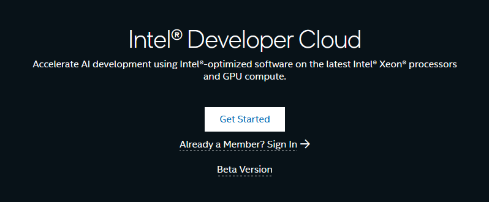

# oneAPI_IberianTour23

## Contenidos
* En este repositorio se encuentran los códigos propuestos en el taller [oneAPI-Day: Intel oneAPI Iberian Tour](https://www.danysoft.com/intel-software-iberian-tour/)
* Para poner a punto el taller se recomienda seguir los pasos de la sección [Setup del lab](#setup-del-lab)
* Los códigos que vamos a trabajar están disponibles en la [sección "Ejemplos"](#ejemplos), resumidamente trabajan algunos de los aspectos mostrados en la parte teórica:
    * helloWorld: ilustra la selección de dispositivos
    * Suma de vectores: suma de vectores
    * Migración de código CUDA a SYCL (suma vectores)

* La descripción del [Hands-on](#to-do) se puede consultar a final de este fichero
    * Tratamiento de imágenes: reducción de ruido tipo sal & pimienta
    * Migración de código CUDA a SYCL (uso de librería *cuBLAS*)

# Setup del lab
## Repositorio 
* Puede descargarse fácilmente clonando el repositorio ejecutando en un terminal el comando ```git clone https://github.com/garsanca/oneAPI_IberianTour23```

## Transparencias
* Todo el material está disponible en el repositorio en la carpeta [Slides](Slides/)
   
   
## Cuenta en Intel Developer Cloud
* El [Intel® Developer Cloud](https://www.intel.com/content/www/us/en/developer/tools/devcloud/services.html) es un espacio de desarrollo **gratuito** para que la comunidad de desarrolladores puedan programar aplicaciones. 


### Hardware disponible
* Se puede testear y evaluar una variedad de máquinas virtuales
    * Sistemas *bare metal*
    * Dispositivos en el Edge
    * Plataformas para entrenamiento de IA
* Entornos para desarrollo
    * Contenedores
    * JupyterLabs
    * Conexión directa por SSH
    


### Instrucciones de acceso
* La documentación y actualizaciones disponible en [https://tinyurl.com/ReadmeIDC](https://tinyurl.com/ReadmeIDC) o en el [Readme.md](https://github.com/bjodom/idc)


### Registro
* Para disponer de cuenta en [Intel® Developer Cloud](https://www.intel.com/content/www/us/en/developer/tools/devcloud/services.html) se puede acceder seguir el enlace http://cloud.intel.com
* Siguiendo los pasos del proceso de registro:



1. Selección de **usuario Stardard**
2. Creación de cuenta


3. Introducción de datos personales


4. Verificación de correo mediante envío de email con un **código**

5. Aceptación de [términos y condiciones de uso](https://scheduler.cloud.intel.com/public/intel_developer_cloud_access_agreement.html) del Intel® Developer Cloud

### Acceso
* Para acceder a la cuenta en [Intel® Developer Cloud](https://www.intel.com/content/www/us/en/developer/tools/devcloud/services.html)
    * Clicar en **Already a Member? Sign In** e introducir las credenciales creadas anteriormente
* O bien se puede hacer con el "atajo" https://console.cloud.intel.com/


### Training
* JupyterLabs: en el menú **Training and Workshops**
    * Clicar en **LaunchJupyterLab**


* SSH: se puede conectar al IDC vía ssh previamente añadiendo las [*Account Keys*](https://console.cloud.intel.com/security/publickeys)


#### Configuración SSH
* Modificar el fichero *.ssh/config*

```bash
Host myidc #←YOU CAN CALL IT ANYTHING
Hostname idcbetabatch.eglb.intel.com
User uXXXXXX #← Request "scheduled access" at https://scheduler.cloud.intel.com/#/systems" to get your user identifier.
#ProxyCommand /usr/bin/nc -x YourProxy:XXXX %h %p # Uncomment if necessary
ServerAliveInterval 60
ServerAliveCountMax 10
StrictHostKeyChecking no # Frequent changes in the setup are taking place now, this will help reduce the known hosts errors.
UserKnownHostsFile=/dev/null
```

* En nodo *frontend* o *head* es un Ubuntu 22.04LTS
* Uso de nodo en modo interactivo: *srun --pty bash*
    * Nodo con Intel Data Center GPU Max 1100

``` bash 
user@localhost:~$ ssh myidc
uXXXX@idc-beta-batch-head-node:~$ srun --pty bash
uXXXX@idc-beta-batch-pvc-node-03:~$ source /opt/intel/oneapi/setvars.sh 
 
:: initializing oneAPI environment ...
   bash: BASH_VERSION = 5.1.16(1)-release
   args: Using "$@" for setvars.sh arguments: 

uXXXX@idc-beta-batch-pvc-node-03:~$ sycl-ls
Warning: ONEAPI_DEVICE_SELECTOR environment variable is set to opencl:cpu;opencl:fpga;level_zero:3.
To see the correct device id, please unset ONEAPI_DEVICE_SELECTOR.

[opencl:cpu:0] Intel(R) OpenCL, Intel(R) Xeon(R) Platinum 8480L 3.0 [2023.16.7.0.21_160000]
[opencl:acc:1] Intel(R) FPGA Emulation Platform for OpenCL(TM), Intel(R) FPGA Emulation Device 1.2 [2023.16.7.0.21_160000]
[opencl:cpu:2] Intel(R) OpenCL, Intel(R) Xeon(R) Platinum 8480L 3.0 [2023.16.7.0.21_160000]
[ext_oneapi_level_zero:gpu:0] Intel(R) Level-Zero, Intel(R) Data Center GPU Max 1100 1.3 [1.3.26516]
```

### Comandos Slurm 
* *sinfo*: obtener información de los nodos disponibles
* *squeue*: trabajos encolados
* *sbatch -p {PARTITION-NAME} {SCRIPT-NAME}*: encolar trabajo en las colas
* *scancel {JOB-ID}*: cancelar trabajo 
* *srun --pty bash*: lanzamiento de trabajo de forma interactiva

### Ejemplo lanzamiento job
1. Tomemos como ejemplo un código en SYCL que devuelve el **device** seleccionado en este caso una GPU
```c
#include <sycl/sycl.hpp>
using namespace sycl;
int main() {
//# Create a device queue with device selector
  queue q(gpu_selector_v);
//# Print the device name
  std::cout << "Device: " << q.get_device().get_info<info::device::name>() << "\n";
  return 0;
}
```

2. Podemos compilarlo con el compilador icpx
```bash
uXXXX@idc-beta-batch-pvc-node-03:~$ icpx -o ex exampleSYCL.cpp -fsycl
```

3. Lanzar job mediante slurm
```job
#!/bin/bash
#SBATCH --job-name=gpu_run
#SBATCH --partition=pvc-shared
#SBATCH --error=job.%J.err 
#SBATCH --output=job.%J.out
#SBATCH --mail-type=ALL
#SBATCH --mail-user=your@email.com

icpx -o ex exampleSYCL.cpp -fsycl
./ex
```

4. Lanzamos el job y visualizamos salida
```bash
uXXXX@idc-beta-batch-head-node:~$ sbatch job.sh
uXXXX@idc-beta-batch-head-node:~$ more job.42151.out 
Device: Intel(R) Data Center GPU Max 1100
```

### Lanzar Jupyterlab interactivo
1. Conexión por ssh al nodo *head-node*: *ssh myidc*
2. Lanzar sesión interactiva: *srun --pty bash*
3. Activar el entorno conda para poder lanzar Jupyter-Lab: *conda activate pytorch_xpu*
4. Lanzar Jupyterlab
    * Importante buscar la dirección de escucha del Jupyterlab, algo parecido a *http://10.10.10.X:8888/lab?token=9d83e1d8a0eb3ffed84fa3428aae01e592cab170a4119130*

```bash
user@localhost:~$ ssh myidc
uXXXX@idc-beta-batch-head-node:~$ srun --pty bash
uXXXX@idc-beta-batch-pvc-node-03:~$ source /opt/intel/oneapi/setvars.sh 
uXXXX@idc-beta-batch-pvc-node-03:~$ conda activate pytorch-gpu
(pytorch-gpu) uXXXX@idc-beta-batch-pvc-node-04:~$ jupyter-lab --ip $(hostname -i)
....
[I 2023-11-11 15:01:56.875 ServerApp] http://10.10.10.8:8888/lab?token=f25e4d3977b7b059d5ff4b376085562dbbaa3f9dffed4fde
....
```

5. Desde otro **terminal local** hacer un tunel ssh a la dirección que aparece en la consola lanzada: **10.10.10.X**

```bash
user@localhost:~$ ssh myidc -L 8888:10.10.10.8:8888
```

6. Conectarse con un navegador a la dirección local: **https://localhost:8888** e introducir el **token** que aparece en el ejemplo en este ejemplo *f25e4d3977b7b059d5ff4b376085562dbbaa3f9dffed4fde*

### Instancias en IDC
* Core compute
    * Basada en procesador Xeon 4th gen
       * VMs con 8, 16, 32 cores
       * Bare Metal 112 cores, 256GB y 2TB disco
* Intel Max GPU
    * 4xGPUs 1100 + 2xsockets Xeon 4th gen
* Gaudi Deep Learning Server
    * 8x Gaudi HL + Xeon Platinum 3gen
       


### Lanzar instancia
1. Lanzar instancia en la [consola->Hardware Catalog](https://console.cloud.intel.com/hardware)
2. Obtener la forma desde el apartado de [reservas](https://console.cloud.intel.com/compute/myreservations), por ejemplo mediante conexión ssh


# Ejemplos

## helloWorld
1. En este [ejemplo](helloWorld/main.cpp) vamos a ver como se selecciona un dispositivo
2. Como se elige el dispositivo: **sycl::device**
    * Lanzamiento de **kernel** a la *command-queue* asíncrona

* La siguiente tabla muestra la nomenclatura para seleccionar y asociar la cola a los dispositivos

|   |   |
|---|---|
|**type**                 | **Device**                                                   |
| default\_selector_v     | Selects any device or host device if no device can be found  |
| gpu\_selector_v         | Select a GPU                                                 |
| accelerator\_selector_v | Select an accelerator                                        |
| cpu\_selector_v         | Select a CPU device                                          |
|*my\_device\_selector*   | *Custom selector*                                            | 


* El siguiente [código](helloWorld/main.cpp) disponible en el directorio [helloWorld](helloWorld/) muestra un ejemplo de selección, donde
    * La línea ```d = sycl::device(sycl::gpu_selector_v)``` seleccione el dispositivo
    * La clase ```d.get_info``` devuelve informacion asociada al dispositivo
    * el ```single_task``` escribe en la salida la cadena "Hello, World!", que está asociada a la ejecución en el **dispositivo seleccionado**


```c
int main(int argc, char **argv) {

	auto d = sycl::device(sycl::gpu_selector_v);
	std::cout << "Using " << d.get_info<sycl::info::device::name>() << "\n";

	sycl::queue Q(d);

	Q.submit([&](handler &cgh) {
		// Create a output stream
		sycl::stream sout(1024, 256, cgh);
		// Submit a unique task, using a lambda
		cgh.single_task([=]() {
			sout << "Hello, World!" << sycl::endl;
		}); // End of the kernel function
	});   // End of the queue commands. The kernel is now submited

	// wait for all queue submissions to complete
	Q.wait();


  return 0;
}

```

* Para compilar los código existe un fichero [Makefile](helloWorld/Makefile) que invocando **make** en consola genera el ejecutable **exec**

```bash
user@host:~/ $ make
icpx -c -o main.o main.cpp -I. -fsycl
icpx -o exec main.o -I. -fsycl  
user@host:~/ $ ls
exec  main.cpp  main.o  Makefile

user@host:~/ $ ./exec 
Using Intel(R) UHD Graphics 620
Hello, World!
```
### ToDo
* Se recomienda experimentar con el cambio de **selector** para seleccionar CPU/GPU...


## Suma de vectores
* El siguiente [ejemplo](vector_add/vector_add.cpp) ilustra el código de suma de vectores $C_{i} = A_{i}+B_{i}$
    * El alumno deberá de completar el código que aparece con el texto **TODO** 


```c
int *a; //TODO: create vectors with USM
int *b; //TODO: create vectors with USM
int *c; //TODO: create vectors with USM

// Parallel for
for(int i=0; i<N; i++){
	a[i] = i;   // Init a
	b[i] = i*i; // Init b
}


// Create a kernel to perform c=a+b
Q.submit([&](handler &h) { 
	/* To Do!!! */
}

for(int i=0; i<N; i++)
	std::cout << "c[" << i << "] = " << c[i] << std::endl;

free(a, Q);
free(b, Q);
free(c, Q);
```

### ToDo
1. Rellenar la reserva de memoria de *a*, *b* y *c* empleando el esquema de USM
2. Además se debe de codificar el kernel de suma de vectores dentro del **Q.submit**

## Migración de CUDA a SYCL
* La herramienta de compatibilidad DPCT (DPC++  Compatibility Tool) ayuda a los desarrolladores a migrar código escrito en [CUDA a DPC++](https://www.intel.com/content/www/us/en/developer/tools/oneapi/dpc-compatibility-tool.html), generando código legible siempre que sea posible
    * El 90-95% del código se migra automáticamente
* Proporciona comentarios para ayudar a los desarrolladores a completar la migración
* Más info DPCT
    * Consulta la [guía y referencia](https://www.intel.com/content/www/us/en/docs/dpcpp-compatibility-tool/developer-guide-reference/2023-2/overview.html)
    * Visita la [Release Notes](https://software.intel.com/content/www/us/en/develop/articles/release-notes-for-intel-dpcpp-compatibility-tool.html) para encontrar información más actualizada

### Pasos
1. Preparar la fuente CUDA para la migración
    * La herramienta de compatibilidad DPCT busca encabezados CUDA
2. Migración del proyecto: **ejecución del herramienta compatibilidad**
    * Para proyectos simples, migración de archivo a archivo
    * Para proyectos complejos, se puede usar un proyecto de Microsoft Visual Studio o el archivo Make/Cmake para crear una base de datos de compilación
3. Revisar código convertido
    * Los archivos de salida contienen [anotaciones](https://software.intel.com/content/www/us/en/develop/documentation/intel-dpcpp-compatibility-tool-user-guide/top/diagnostics-reference.html) para ayudar a migrar cualquier código restante que no se haya podido migrar automáticamente
4. Compiladado con Intel® oneAPI DPC++/C++


### Requisitos Software
* Instalación de DPCT (Intel oneAPI Base Toolkit)
    * Invocación de entorno ```source /opt/intel/oneapi/setvars.sh```
* Cabeceras de CUDA
    * /usr/local/cuda/include
    * /usr/local/cuda-x.y/include, donde x.y deben de ser algunas de las versiones: 8.0, 9.x, 10.1, 10.2, 11.0~11.8, 12.0

### Preparación del Developer Cloud
1. Descargarse las cabeceras de CUDA con el comando ```git clone --recursive https://gitlab.com/nvidia/headers/cuda.git```
2. Preparar las cabeceras compactadas en un único directorio:
```bash
uXXXX@idc-beta-batch-head-node:~$ git clone --recursive https://gitlab.com/nvidia/headers/cuda.git
uXXXX@idc-beta-batch-head-node:~$ mkdir cuda-headers/
uXXXX@idc-beta-batch-head-node:~$ cp -r cuda/cudart/* cuda-headers/
uXXXX@idc-beta-batch-head-node:~$ cp -r cuda/curand/* cuda-headers/
uXXXX@idc-beta-batch-head-node:~$ cp -r cuda/nvcc/crt/ cuda-headers/
uXXXX@idc-beta-batch-head-node:~$ cp cuda/cublas/* cuda-headers/
```
### Ejemplo
* Para ilustrar el funcionamiento de la herramienta DPCT vamos a utilizar el ejemplo de suma de vectores que se puede encontrar en [GitHub](https://github.com/oneapi-src/oneAPI-samples/tree/master/Tools/Migration/vector-add-dpct)
    * O bien haciendo uso de la herramienta [oneapi-cli](https://www.intel.com/content/www/us/en/docs/oneapi-hpc-toolkit/get-started-guide-linux/2023-2/overview.html) que contiene muchos ejemplos:
        1. "Create a project"
        2. "cpp"
        3. "oneAPI Tools->Migration->Vector Add DPCT"


* Una vez preparados los códigos de CUDA que se encuentran en la carpeta [DPCT-examples](DPCT-examples/vector-add-dpct/) podemos hacer uso de la herramienta DPCT
* Vamos a utilizar DPCT con el [único fichero fuente CUDA](DPCT-examples/vector-add-dpct/src/vector_add.cu)
```bash
uXXXX@idc-beta-batch-pvc-node-04:~$ c2s --cuda-include-path=/home/uXXXX/cuda-headers/ --out-root=. vector-add-dpct/src/vector_add.cu
NOTE: Could not auto-detect compilation database for file 'vector_add.cu' in '/home/uXXXX/vector-add-dpct/src' or any parent directory.
Parsing: /home/uXXXX/vector-add-dpct/src/vector_add.cu
Analyzing: /home/uXXXX/vector-add-dpct/src/vector_add.cu
Migrating: /home/uXXXX/vector-add-dpct/src/vector_add.cu
Processed 1 file(s) in -in-root folder "/home/uXXXX/vector-add-dpct/src"

See Diagnostics Reference to resolve warnings and complete the migration:
https://software.intel.com/content/www/us/en/develop/documentation/intel-dpcpp-compatibility-tool-user-guide/top/diagnostics-reference.html

```
* Nos informa de algunos **warnings** que vienen motivado a la diferencia en la API de CUDA y SYCL. Para más información conviene consultar la información de [**diagnóstico**](https://software.intel.com/content/www/us/en/develop/documentation/intel-dpcpp-compatibility-tool-user-guide/top/diagnostics-reference.html) que muestran la correspondencia de los códigos de aviso

* Ya estamos en capacidad de compilar el código generado con en compilador **icpx** y ejecutarlo:

```bash
uXXXX@idc-beta-batch-pvc-node-04:~$  icpx -o vector vector_add.dp.cpp -fsycl
uXXXX@idc-beta-batch-pvc-node-04:~$  ./vector

  2   4   6   8  10  12  14  16  18  20  22  24  26  28  30  32 
 34  36  38  40  42  44  46  48  50  52  54  56  58  60  62  64 
 66  68  70  72  74  76  78  80  82  84  86  88  90  92  94  96 
 98 100 102 104 106 108 110 112 114 116 118 120 122 124 126 128 
130 132 134 136 138 140 142 144 146 148 150 152 154 156 158 160 
162 164 166 168 170 172 174 176 178 180 182 184 186 188 190 192 
194 196 198 200 202 204 206 208 210 212 214 216 218 220 222 224 
226 228 230 232 234 236 238 240 242 244 246 248 250 252 254 256 
258 260 262 264 266 268 270 272 274 276 278 280 282 284 286 288 
290 292 294 296 298 300 302 304 306 308 310 312 314 316 318 320 
322 324 326 328 330 332 334 336 338 340 342 344 346 348 350 352 
354 356 358 360 362 364 366 368 370 372 374 376 378 380 382 384 
386 388 390 392 394 396 398 400 402 404 406 408 410 412 414 416 
418 420 422 424 426 428 430 432 434 436 438 440 442 444 446 448 
450 452 454 456 458 460 462 464 466 468 470 472 474 476 478 480 
482 484 486 488 490 492 494 496 498 500 502 504 506 508 510 512 

```

# To-Do
## Tratamiento de imágenes
* El siguiente ejemplo ilustra la **reducción de Ruido en una imagen (sal y pimienta)**


* Para ello se utiliza el filtro de mediana, en una vecindad de 3x3
    * Es decir que dado un píxel en la posición de la imagen (i,j), su valor será ```im[i][j]```
    1. Se guardan los vecina del pixel (i,j) de forma temporal
    2. Se ordenan los valores de los píxel de la vecindad 3x3: **sort**
    3. Para obtener el valor de la mitad de la ordenación
         * Si no se supera un umbral el pixel de salida es equivalente al de la entrada
         * En caso contrario el pixel resultante sería el valor de la mediana


* Compilación: por medio del [*make*](image_salt_pepper/Makefile)
* Ejecución: **host** y **device**, con el último flag de línea de comandos
     * host: ```./main LennaSALTPEPPER.bmp output.bmp h```
     * device: ```./main LennaSALTPEPPER.bmp output.bmp g```

### ToDo

* El kernel a desarrollar está en el fichero [**kernels.cpp**](image_salt_pepper/kernels.cpp)
     * Posee como entrada la cola *Q*, imágen de entrada en *im*, valor umbral *thredshold*, alto y ancho de la imagen *height, width*
     * La imagen de salida se escribe en **image_out**
     * La selección de la cola se realiza en el fichero [**main.cpp**](image_salt_pepper/main.cpp) y la memoria para la imagen de entrada y salida se reserva mediante el mecanismo de USM

## Migración de código CUDA a SYCL avanzada (librerías)
* El ejemplo ha sido extraido del repositorio de [oneAPI-samples](https://github.com/oneapi-src/oneAPI-samples/tree/master/DirectProgramming/C%2B%2BSYCL/DenseLinearAlgebra/guided_matrix_mul_SYCLMigration) donde se plantea el uso de DPCT con librerías de álgebra linear como cuBLAS
* Para ello emplearemos el ejemplo de la multiplicación de matrices haciendo uso del código **matrixMulCUBLAS** disponible en [los ejemplos de CUDA](https://github.com/NVIDIA/cuda-samples/tree/master/Samples/4_CUDA_Libraries/matrixMulCUBLAS)

### Preparación del ejemplo
1. Descargamos el ejemplo disponible en el [GitHub](https://github.com/NVIDIA/cuda-samples/tree/master/Samples/4_CUDA_Libraries/matrixMulCUBLAS) ```git clone https://github.com/NVIDIA/cuda-samples.git```
2. Invocamos a la herramienta **Intercerpt-build tool**: ```intercept-build make``` que genera un archivo json con todos los archivos de origen que implican en el proyecto
3. Invocamos a la herramienta de migración **DPCT** o **SYCLomatic**: ```dpct -p compile_commands.json``` o ```c2s -p compile_commands.json```
4. Revisamos los mensaje de diagnóstico 
5. Compilamos el fichero "migrado" teniendo en cuenta que la llamada a **cublasSgemm** ahora es traducida por la llamada **oneapi::mkl::blas::column_major::gemm** de la librería [oneMKL](https://www.intel.com/content/www/us/en/docs/oneapi/programming-guide/2023-0/intel-oneapi-math-kernel-library-onemkl.html)
    * Para compilar el código generado se necesitan añadir los flags de compilación de oneMKL que pueden consultarse en la herramienta de ayuda ["link-advisor"](https://www.intel.com/content/www/us/en/developer/tools/oneapi/onemkl-link-line-advisor.html)
    * NOTA: Comentar las líneas 91-96 que solicitan conocer el dispositivo porque es algo específico de la API de CUDA

```bash
uXXXX@idc-beta-batch-pvc-node-04:~$  git clone https://github.com/NVIDIA/cuda-samples.git
uXXXX@idc-beta-batch-pvc-node-04:~$  cd cuda-samples/Samples/4_CUDA_Libraries/simpleCUBLAS
uXXXX@idc-beta-batch-pvc-node-04:~/cuda-samples/Samples/4_CUDA_Libraries/simpleCUBLAS$ intercept-build make
uXXXX@idc-beta-batch-pvc-node-04:~/cuda-samples/Samples/4_CUDA_Libraries/simpleCUBLAS$ c2s --cuda-include-path=/home/uXXXX/cuda-headers/  -p compile_commands.json
uXXXX@idc-beta-batch-pvc-node-04:~/cuda-samples/Samples/4_CUDA_Libraries/simpleCUBLAS$ icpx -o simpleCUBLAS dpct_output/simpleCUBLAS.cpp.dp.cpp -fsycl  -L${MKLROOT}/lib/intel64 -lsycl -lOpenCL -lpthread -lm -ldl -DMKL_ILP64  -qmkl=parallel  -I../../../Common/
```